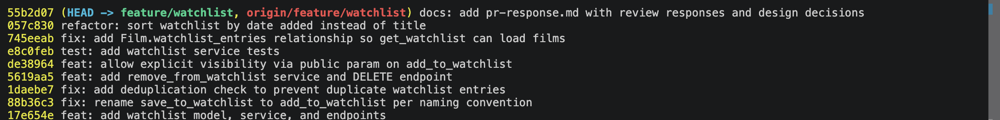

# PR Response Doc — CineLog Watchlist Feature

This document records how I addressed each of the six review comments from
@dev-lead on the watchlist PR, the reasoning behind the two design decisions,
and how I resolved the rebase onto `main`.

---

## AI Usage

I used AI tooling in three bounded ways on this project:

1. **Codebase orientation.** Before reading the review comments, I had AI
   summarize `models.py`, `services/collection_service.py`, and
   `tests/test_collection.py` — specifically how `add_to_collection()` does its
   deduplication (film lookup → existing-entry check → raise) and how the test
   fixtures (`app`, `sample_user`, `sample_film`) are wired. I verified every
   summary against the actual code before relying on it.
2. **Pattern matching & hygiene.** I used AI to confirm my new code matched the
   existing `verb_to_noun` / custom-exception / route-error-handling patterns,
   and to sanity-check that my commit messages follow the Conventional Commits
   spec (`feat:`, `fix:`, `test:`, `refactor:`, `docs:`).
3. **Stress-testing the design decisions (Comments 4 & 5).** I chose my
   positions first, then asked AI to argue the *opposing* side — "what
   counterargument would a careful reviewer raise?" That surfaced the
   privacy-by-default objection (Comment 4) and the list-stability objection
   (Comment 5), which I then explicitly acknowledged in my write-ups below.

The two design *decisions* are my own. I based both on my own experience with
Letterboxd (public/private watchlists on a sharing platform for Comment 4, and
date-added ordering feeling more like a journey for Comment 5), then used AI to
tighten the grammar and phrasing — not to choose the positions or supply the
reasoning.

---

## Comment 1 — Rename `save_to_watchlist()` → `add_to_watchlist()`

**What I did:**
Renamed the service function in `services/watchlist_service.py` and updated its
single call site in `routes/watchlist/watchlist.py` (both the `import` and the
call inside `add_film()`).

**How I found all call sites:**
Ran `grep -rn "save_to_watchlist" . --include='*.py'`, which returned exactly
three hits: the definition and the two references in the route. After renaming,
I re-ran the same grep and confirmed **zero** remaining references.

**How I verified:** `pytest tests/ -v` stayed green, and the app imports cleanly
(`from services.watchlist_service import add_to_watchlist`). The new name now
matches the project convention set by `add_to_collection()`.

---

## Comment 2 — Deduplication

**What I did:**
Modeled the fix directly on `add_to_collection()`:
- Added an `AlreadyInWatchlistError` exception (parallel to
  `AlreadyInCollectionError`).
- In `add_to_watchlist()`, after the film-existence check, I query for an
  existing `WatchlistEntry` with the same `(user_id, film_id)` and raise
  `AlreadyInWatchlistError` if one exists — before creating a new row.
- Added a `UniqueConstraint("user_id", "film_id", name="unique_user_film_watchlist")`
  to the `WatchlistEntry` model as a database-level backstop, mirroring the
  constraint on `CollectionEntry`.
- Wired the route to catch the exception and return **409 Conflict** (and
  **404** for a missing film), matching how the collection route reports these.

**How I verified:**
`tests/test_watchlist.py::test_add_to_watchlist_duplicate_raises` asserts the
second add raises and that only one row exists afterward. I also added
`test_add_to_watchlist_dedup_is_per_user` to confirm the check is scoped to
`(user_id, film_id)` — a different user can still add the same film.

---

## Comment 3 — Missing test (nonexistent `film_id`)

**What I did:**
Created `tests/test_watchlist.py`, reusing the fixture structure from
`test_collection.py` (`app` with in-memory SQLite, `sample_user`,
`sample_film`). I ported `test_add_to_collection_nonexistent_film_raises` into
`test_add_to_watchlist_nonexistent_film_raises`, which passes a UUID that isn't
in the DB and asserts `FilmNotFoundError` is raised (not a DB integrity error).

**How I verified:** `pytest tests/test_watchlist.py -v` — the test passes, and
the full suite is green (11 passed).

**Model used:** `tests/test_collection.py::test_add_to_collection_nonexistent_film_raises`.

---

## Comment 4 — Default visibility (`public=True`)

**My position:** Keep `public=True` as the default, but add a private toggle so
users who want it can opt out. I want this to be an explicit, documented choice,
which is what @dev-lead asked for.

**Reasoning (grounded in CineLog):**
I'm drawing on Letterboxd here, since it's the closest comparison to what we're
building. On Letterboxd a user can make their watchlist public or private, but
because it's a sharing platform, most of the value comes from being able to see
what other people are planning to watch. CineLog is the same kind of sharing
platform, so I think we should lean into that and start watchlists public by
default — that's where the social discovery and engagement come from. The
`WatchlistEntry` model already has a per-entry `public` boolean, so the design
already treats visibility as something the user controls rather than a hidden
global. Defaulting to public just makes the community side work out of the box,
while still leaving room for people who want privacy.

**Tradeoff acknowledged:**
The downside is that a public default can surprise users who assumed their
watchlist was private, and I'm not ignoring that. I mitigate it with the private
toggle: I added a `public` parameter to `add_to_watchlist()` so a user can create
a private entry deliberately, and because visibility is per-entry, they can keep
certain films private while sharing the rest. If we ever see that
public-by-default is causing real confusion, flipping the default is a one-line
change — but for a sharing-first platform like ours, I'd rather start public and
give people the option, the way Letterboxd does.

---

## Comment 5 — Sort order

**My position:** Agree with @dev-lead — switch from alphabetical (by title) to
**date added, most recent first**.

**Engagement with the reviewer's point:**
This lines up with what @dev-lead said about people wanting to see what they
added recently, and it also matches my own experience as a Letterboxd user. When
I open a list, I want to see it in the order I added things, not alphabetically —
it's way more engaging that way, and it feels more like a journey or a timeline
of what I've been meaning to watch than a flat A–Z index. There's also a
CineLog-specific reason: `get_collection()` already sorts by `date_added`
descending, so sorting the watchlist the same way keeps the two views consistent
for users and keeps the code parallel for the next contributor.

The main argument for alphabetical is looking up a film you already know is on
the list, but that's really a search/filter job, not what the default sort
should be optimizing for. A watchlist is something you skim for your next watch,
not a reference table you scan by letter.

**Tradeoff acknowledged:**
Sorting by date added means the list reorders each time you add a film, so anyone
who memorized positions loses that. For a personal queue I think that's a fair
trade, and if stable ordering ever matters we can add sort as a query parameter
later.

**What I did:** Changed `get_watchlist()` to
`order_by(WatchlistEntry.date_added.desc())` (dropping the now-unneeded title
join) and added `test_get_watchlist_returns_newest_first` to lock the behavior
in.

---

## Comment 6 — Rebase onto updated `main`

**What conflicted:**
A refactor merged to `main` (`refactor: migrate film IDs from integer to UUID`)
that (a) changed `Film.id` and `CollectionEntry.film_id` from `Integer` to
`String(36)` UUIDs, and (b) — in the same commit — **removed the
`WatchlistEntry` class from `models.py`** (since watchlist hadn't landed on main
yet). My branch hadn't modified the `WatchlistEntry` class itself (it was
unchanged since the merge base), so during `git rebase origin/main`, git's
3-way merge resolved "deleted on main + unchanged on my branch" as a **delete**
— silently dropping `WatchlistEntry` with **no conflict markers**. The textual
merge looked clean but the app was broken: `ImportError: cannot import name
'WatchlistEntry' from 'models'`.

**How I resolved it:**
Re-added the `WatchlistEntry` model, but with `film_id = db.Column(db.String(36),
db.ForeignKey("film.id"))` — a **UUID**, not the original `Integer` — so it
matches the refactored `Film.id`. I also updated the `int`-era docstrings in
`services/watchlist_service.py` (`film_id (int)` → `film_id (str): UUID`) and the
route (`{ "film_id": <int> }` → `{ "film_id": "<uuid>" }`).

**How I verified no conflict remains:**
- `grep` confirmed no remaining `db.Integer` on any `film_id` and no `<int>`
  docstrings.
- Full suite green: `pytest tests/ -v` → 11 passed (the tests exercise real
  UUID film ids end-to-end).
- Ran `get_watchlist()` at runtime to confirm the model/relationship load.
- `git log --merges origin/main..HEAD` returns **nothing** — the branch is
  linear on top of `main` with **no merge commits**.

---

## Stretch features

- **`remove_from_watchlist(user_id, film_id)`** — implemented following the
  `remove_from_collection` pattern: raises `NotInWatchlistError` when the film
  isn't on the list, otherwise deletes and returns `True`. Exposed as
  `DELETE /watchlist/<user_id>/remove`. Tested by
  `test_remove_from_watchlist_removes_entry` and
  `test_remove_from_watchlist_not_present_raises`.

- **Second (self-chosen) test — `test_add_to_watchlist_dedup_is_per_user`.**
  I chose this edge case because the most likely way to get deduplication
  *wrong* is to make it global instead of per-user. This test proves a second
  user can add a film the first user already saved, guarding the exact boundary
  of the Comment 2 fix.

- **Visibility toggle** — added an optional `public` parameter to
  `add_to_watchlist()` (default `True`) and threaded it through the `POST /add`
  endpoint (`data.get("public", True)`), so callers can create a private entry
  explicitly instead of relying on the default. This is the concrete opt-out
  referenced in my Comment 4 reasoning.

---

## Commit history

Rewritten into clean, one-logical-change-per-commit Conventional Commits, rebased
on `main` with no merge commits (`git log --oneline`):



```
55b2d07 docs: add pr-response.md with review responses and design decisions
057c830 refactor: sort watchlist by date added instead of title
745eeab fix: add Film.watchlist_entries relationship so get_watchlist can load films
e8c0feb test: add watchlist service tests
de38964 feat: allow explicit visibility via public param on add_to_watchlist
5619aa5 feat: add remove_from_watchlist service and DELETE endpoint
1daebe7 fix: add deduplication check to prevent duplicate watchlist entries
88b36c3 fix: rename save_to_watchlist to add_to_watchlist per naming convention
17e654e feat: add watchlist model, service, and endpoints
```

9 commits, all Conventional Commits, no merge commits, rebased on `main`.

---

## PR Description

### What the watchlist feature does
Adds a personal **watchlist** so users can save films they want to watch later,
separate from their (already-watched) collection. It introduces:
- a `WatchlistEntry` model (`user_id`, `film_id` UUID, `date_added`, `public`);
- service functions `add_to_watchlist`, `remove_from_watchlist`, `get_watchlist`;
- REST endpoints:
  - `GET  /watchlist/<user_id>` — list the user's watchlist, newest first
  - `POST /watchlist/<user_id>/add` — body `{ "film_id": "<uuid>", "public": true }` (`public` optional)
  - `DELETE /watchlist/<user_id>/remove` — body `{ "film_id": "<uuid>" }`

Adding a film that doesn't exist returns **404**; adding a duplicate returns
**409**; removing a film that isn't on the list returns **404**.

### Design decisions made
1. **Default visibility = `public=True`** (Comment 4). Community-discovery-first,
   since CineLog's value is social; mitigated by a per-entry `public` opt-out.
2. **Sort order = date added, newest first** (Comment 5). Matches how a queue is
   used and stays consistent with `get_collection()`.

### How to manually test
```bash
python -m venv .venv && source .venv/bin/activate
pip install -r requirements.txt
python app.py                      # serves http://127.0.0.1:5000

# In another shell — you need a real user id and film id from the DB.
# (Create them via a Python shell or your seed data; IDs are UUIDs.)

# Add a film to the watchlist
curl -X POST http://127.0.0.1:5000/watchlist/<user_id>/add \
     -H "Content-Type: application/json" \
     -d '{"film_id": "<film_uuid>"}'                       # -> 201

# Add the same film again
curl -X POST http://127.0.0.1:5000/watchlist/<user_id>/add \
     -H "Content-Type: application/json" \
     -d '{"film_id": "<film_uuid>"}'                       # -> 409 (dedup)

# Add a nonexistent film
curl -X POST http://127.0.0.1:5000/watchlist/<user_id>/add \
     -H "Content-Type: application/json" \
     -d '{"film_id": "00000000-0000-0000-0000-000000000000"}'  # -> 404

# Add a private entry
curl -X POST http://127.0.0.1:5000/watchlist/<user_id>/add \
     -H "Content-Type: application/json" \
     -d '{"film_id": "<another_film_uuid>", "public": false}'  # -> 201, public=false

# View the watchlist (newest added first)
curl http://127.0.0.1:5000/watchlist/<user_id>

# Remove a film
curl -X DELETE http://127.0.0.1:5000/watchlist/<user_id>/remove \
     -H "Content-Type: application/json" \
     -d '{"film_id": "<film_uuid>"}'                       # -> 200

# Automated: the full suite
pytest tests/ -v                                           # 11 passed
```
